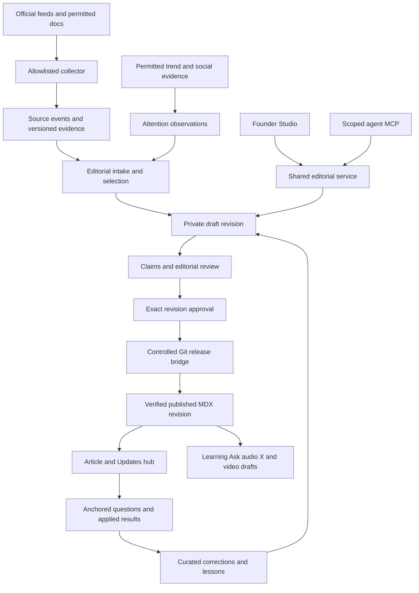

# abdur ai community platform system design

**Architecture proposal · 9 October 2026 · Prepared by Codex for Abdur.** Extends the existing [publishing and contextual discussion plan](https://linear.app/agencyflow/document/abdurai-publishing-learning-and-contextual-discussion-proposal-claude-a4e624b9d64a), [AGE-2970](https://linear.app/agencyflow/issue/AGE-2970) and [AGE-2391](https://linear.app/agencyflow/issue/AGE-2391). Product and implementation contracts below are proposed; the founder's first-person example law is locked by his instruction today. This document does not assert that the platform, feeds, jobs or community are deployed.

| Discover | Understand | Participate | Improve |
|---|---|---|---|
| Official AI release + honest interest signals | What changed → how I would use it | Ask about a passage → share a tried result | Review evidence → credit correction → reuse the lesson |

Build AI Updates as an entrance to the interactive community platform. One canonical article connects vendor releases, Abdur's own applications, reader questions, applied results, reusable lessons, and distribution. The North Star remains useful AI authority and at least 1,000 deliberate newsletter subscribers; there is no verified audience or conversion baseline in this work.

## 1 Abstract and recommendation

Extend the existing Next.js application as a modular monolith. Keep published MDX canonical for the first release bridge, introduce genuinely private unpublished revisions, and use the same editorial service from the founder Studio and agent MCP. Keep evidence collection, attention measurement, editorial judgment and publishing permission separate. A worker operates explicit durable jobs; model responses do not acquire publication authority.

The first demonstrable outcome is one official update becoming a useful first-person example, then a reader asking about its precise passage, trying it, and contributing a result that improves the same article. More sources, higher post volume and automatic social delivery are later optimizations. Ask, learning and audio consume verified published revisions; they do not establish truth by repeating model-generated text.

## 2 Goals and boundaries

| Goal | Acceptance boundary |
|---|---|
| Make AI changes useful to builders | Each editorial item contains an original application, source links and claim status |
| Let readers contribute meaningfully | A question, correction or applied result attaches to the same content and revision across entry points |
| Let Abdur publish without operating Git | Studio shows draft, review, publishing, live and failed; a live state requires a verified URL |
| Keep agents useful and accountable | Named author/reviewer/publisher roles, bounded jobs, receipts and independent review |
| Build awareness through examples | Site article produces editable X and video drafts with the same evidence boundaries |

The first slice excludes a full CMS migration, payments, courses marketplace, reputation economy, reader file uploads, automatic social posting, automatic newsletter sequences, unbounded scraping and a ranking system trained on unverified popularity. Evidence contributions accept links and text only initially; links are not automatically fetched. These remain possible extensions, not hidden prerequisites.

## 3 Existing foundations and current evidence

The repository is [asayeed95/abdur-ai](https://github.com/asayeed95/abdur-ai), with Next.js 15 App Router, Tailwind and MDX. Current main was fetched as `c7f0484` on 9 October. The normal local checkout contains unrelated changes; this architecture work does not modify them.

| Foundation | Checked state on 9 October | Implication |
|---|---|---|
| [PR 70](https://github.com/asayeed95/abdur-ai/pull/70) agent actions and embed | Open, conflicting, head `395f52f` | Reuse after integration; no assertion it is live |
| [PR 71](https://github.com/asayeed95/abdur-ai/pull/71) publishing core and MCP | Open, conflicting, head `4be29e7` | Shared validation exists on branch; public draft branches are not private |
| [PR 72](https://github.com/asayeed95/abdur-ai/pull/72) comments and votes | Open, conflicting, head `f89b751` | Starts with post_slug and opt-in comments; section identity is an extension |
| [PR 73](https://github.com/asayeed95/abdur-ai/pull/73) admin editor | Open, conflicting, head `dd393c3`; stacks 71 and 72 | Draft editor and moderation foundation; currently no publish-now lifecycle |
| [AGE-2630](https://linear.app/agencyflow/issue/AGE-2630) intake | Existing Todo issue | Extend this owner for allowlist, provenance and deduplication |
| [AGE-2627](https://linear.app/agencyflow/issue/AGE-2627) newsroom | Existing charter | Retain primary sources, original analysis, corrections and lawful collection |
| [AGE-2884](https://linear.app/agencyflow/issue/AGE-2884) operations | Existing publication cycle | Coordinate limits and leases; do not create a competing unattended publisher |

The PR descriptions and changed-file lists were read; this is not a new line-by-line security audit. Pending database migrations are reported in PR 72, but the live database was not inspected in this run. Current operations documentation says the earlier deployment rate limit has cleared; old failed PR deployment checks do not prove a present outage.

## 4 Product and navigation

Proposed first entrance is `/writing/updates`, matching Abdur's requested placement. Existing articles stay at `/writing/[slug]`. Topic hubs may link to the same article or passage. The Updates feed is `/writing/updates/rss.xml`; it contains our released original editorial work, not a raw mirror of vendor changelogs. Existing writing feeds remain intact. A later top-level News link can point here without creating a second content owner or URL tree.

| Surface | Reader or founder action | Result |
|---|---|---|
| Updates | Filter provider/topic; choose latest or editorial picks | Understand coverage and why an item was selected |
| Article | Read what changed, application and evidence | Distinguish announcement, hypothesis and measured result |
| Passage discussion | Ask, correct, or choose “I tried this” | One anchored thread, also visible under all discussion |
| Applied result | Describe environment, steps, observed result and optional evidence | A labeled community contribution; not automatically a verified fact |
| Topic hub | Enter through Claude Code, agents or evaluation | Open the same article identity and discussion |
| Studio | Review evidence, edit, approve a revision, publish | Visible release status and recoverable failure |
| Learning and Ask | Reuse curated passages or retrieve published sources | Revision-linked lesson or cited answer, with honest gaps |

The signature interaction is **What changed / How I'd use it / What happened when tried**. A missing result is shown as not yet tested. A correction can improve the source article with attribution; reader participation must not manufacture a false sense of consensus.

## 5 Locked editorial law

> “We lead, and we lead by examples.” — Abdur, 9 October 2026

Applications use “This is how I would use it…” when proposed. “I tried…” and “This is what happened…” require a real evidence packet identifying actor, date, environment, steps and result. A vendor assertion remains attributed to the vendor. Agent work must not be rewritten into an experience Abdur personally had. Show drafting assistance and human editorial approval in the byline/source notes when agents contributed; first-person applications represent a scenario the founder has actually reviewed.

| Evidence | Appropriate voice | Required support |
|---|---|---|
| Official announcement | “Anthropic says this release adds…” | Primary release URL and source revision |
| Proposed application | “I would use this to…” | Concrete scenario plus an explicit untested label |
| Personal test | “I tried this in…” | Actual actor, environment, steps and receipts |
| Community result | “A reader reported…” | Attributed contribution; verification status visible |
| Opinion | “My view is…” | Reasoning and limits, no implied measurement |

Preserve the existing `reported`, `designed` and `argued` registers. An article may report a vendor change while containing a separately labeled proposed application; paragraph/claim labels retain that distinction. Do not create a fourth register merely for AI news.

Each brief: useful visual → what changed and when → why it matters to this scenario → how I would use it or what I tried → limits and access caveats → sources → a precise invitation to discuss. Real Northsun/HeyCLI workflows can supply examples only from approved public evidence. No customer data, private architecture, unratified performance claim, fabricated result or forced product pitch.

Example based on the [Claude Code changelog](https://code.claude.com/docs/en/changelog#2-1-295): “I would use a blocking failure rule at the publishing gate. If the claim check cannot run, I would keep the article in review and retry after fixing the check. I have not tested that workflow yet.” This is a proposed application, not a test receipt.

## 6 Sources and attention

Track provider and product separately: OpenAI is a company; ChatGPT and Codex are products. Anthropic and Claude Code have the same distinction. Prioritize these two companies editorially; other providers can lead a story when usefulness and evidence justify it. No fixed popularity quota is assumed.

| Coverage | Official starting source | Adapter |
|---|---|---|
| Claude Code | https://code.claude.com/docs/en/changelog/rss.xml | RSS |
| ChatGPT and Codex | https://learn.chatgpt.com/docs/changelog/rss.xml | Combined official RSS, classify product per entry |
| ChatGPT completeness | https://help.openai.com/en/articles/6825453-chatgpt-release-notes | Permitted document observation/manual fallback |
| OpenAI product releases | https://openai.com/products/release-notes/ | Official RSS advertised; ingestion endpoint must pass access validation |
| GLM and Z.ai | https://docs.z.ai/release-notes/new-released/rss.xml | RSS |
| Kimi | https://platform.kimi.ai/docs/platform-changelog/rss.xml | RSS |
| Perplexity API | https://docs.perplexity.ai/docs/resources/changelog/rss.xml | RSS; distinguish API from consumer updates |
| VS Code | https://code.visualstudio.com/feed.xml | Atom; separate stable and Insiders |
| Gemini | https://blog.google/products-and-platforms/products/gemini/rss/ | Official product news RSS; separate from API/CLI changelogs |

The companion source map records verification details and additional xAI, Copilot, Gemini API and consumer sources. Kimi K3 is confirmed in current official documentation; product versions still come from each observed entry. “Muse AI” remains unresolved: the existing plan calls Swift Abdur's Muse authoring agent. Do not create a vendor source until the intended product is confirmed.

Sources are allowlisted by exact approved host/path and adapter. Retain canonical source IDs, GUIDs, release tags and source timestamps. Some release pages reuse a month title and URL; a month URL is not sufficient identity. Cross-source similarity forms a release cluster for editorial review rather than silently discarding distinct entries. Corrections become new evidence revisions with a visible relationship to their predecessors.

**Attention is supporting evidence.** Google Trends observations retain query or topic ID, geography, time range, category, search property, comparison set, fetch time and source/export reference. Relative interest is not an audience count, and indices from unrelated queries/windows are not directly comparable. Trending Now RSS is not an arbitrary product interest-over-time API. Official API access is an access dependency, not assumed available.

X, Hacker News or other social observations retain query, platform, window, method, source links and coverage limitations. Approved API access or a curator's linked sample is acceptable; a few selected posts cannot support “most talked about.” Missing access is `unknown`, never zero. Keep provider announcement popularity distinct from actual use, quality and community helpfulness.

Selection is explainable: primary evidence eligibility first, then editorial relevance and practical usefulness, then documented attention and freshness. Start with a simple high/medium/low rubric and editor rationale. No opaque global trending score. Show “Editor’s pick” when attention data is missing. Correctness and reader usefulness outrank hype.

## 7 Architecture and trust boundaries



| Component | Responsibility | Boundary |
|---|---|---|
| Collector worker | Fetch, validate, normalize and version evidence | No release credential and no execution of source text |
| Editorial service | Drafts, revision comparison, review, approval validation | Studio and MCP use identical rules |
| Publishing bridge | Export approved safe content, open/update release PR, verify deployment | Dedicated publisher authority, exact approved hash |
| Public reader routes | Render published content, sources and discussion | No access/import path to private draft readers; Studio is a separate authorized server surface in the same app |
| Community service | Identity, anchored threads, results, reports, moderation | Reader evidence remains labeled untrusted until reviewed |
| Derived jobs | Search, learning, narration, distribution drafts | Bind to published revision; invalidate on change/unpublish |

Use the existing isolated abdur-ai database for platform state, subject to its reviewed migrations and backup/restore test. Northsun production is not the community database. Private editorial, evidence and operations tables belong in schemas that are not exposed through the public data API; access them only through the authorized server service. A leased job table and transactional outbox can provide durable jobs initially; adopt a dedicated queue only when measured needs require it. The worker is a separately scoped process, not an always-thinking model. Runtime hosting choice and service credentials must be validated before scheduling.

Keep one owner per revision: private storage owns an unpublished draft; Git owns the released MDX snapshot. Editing a release creates a new private revision. No bidirectional editable sync. Authoring content is structured text/blocks or a constrained markdown subset: do not execute agent-supplied MDX JavaScript. Existing trusted legacy MDX remains on its renderer.

Private storage may be introduced additively, but moving published canonical content out of Git requires a separate architecture decision and migration evidence. A public Git draft branch must never be described as private.

## 8 Lifecycle and API contracts

1. Fetch official evidence with conditional requests and bounded timeout/body size; record `checked_at` separately from vendor event date. Respect terms, robots where applicable and rate limits.
2. Normalize by source identity and item identity. Persist source revision; repeat delivery is idempotent. Suspect parser changes and contradictory dates enter review.
3. Cluster duplicate coverage; attach optional measured attention. Editor records why a story was chosen. No new evidence means no forced draft.
4. Draft a first-person application with source links, claim statuses and visuals. Save privately. Simultaneous writes require `expected_revision`.
5. Review sources, voice, permissions, assets and content. Deterministically export and preview the release privately first, then approve the immutable revision and digest of content, assets and evidence references. Approval explicitly includes permission to disclose this snapshot in the public repository. The Studio explains that public Git disclosure precedes the live article; embargoed or still-private content cannot enter this release path.
6. Open a public release PR containing only that approved snapshot. State is `publishing` until deployed content matches it. Failure preserves the last live site revision, but does not retract material already disclosed in public Git. Retraction requires a visible correction/withdrawal process, not a promise of Git erasure.
7. Index, discussion references and derivatives update through retryable jobs. New comments never silently alter the article; corrections create a new reviewable revision.

| Contract | Input | Guaranteed result |
|---|---|---|
| Collect source | source ID, cursor/ETag | receipt with fetched/skipped/failed outcome; duplicate delivery creates no duplicate event |
| Save draft | content ID, expected revision, bounded content, request key | new revision or explicit 409 conflict |
| Submit review | revision ID, evidence references | review request; no publication permission |
| Approve revision | authenticated approver, revision ID, digest | approval valid only for that exact revision |
| Request release | approval ID, request key | existing/new release ID, never an immediate unverified “live” |
| Read release | release ID | queued/publishing/live/failed/rolled back with relevant receipt |
| Create contribution | content/section/block ID, source revision, kind, text, request key | authorized contribution or validation/rate-limit error |
| Read public material | published content ID | current authorized content only; drafts inaccessible |

Names above are domain contracts, not claims that endpoints already exist. Proposed HTTP writes use authenticated POST/PATCH with same-origin/CSRF controls; MCP calls invoke the same service. Author/reviewer agents cannot forge publisher roles or pass an `approvedBy` string to gain authority. The first slice uses authenticated founder approval. A future deterministic publisher policy is a separate founder decision with expiry, scope, quota and revocation; an LLM output can never grant that authority.

The proposed content-release PR class permits only the approved article, its bounded public assets and the exact required publish-override record. Any application, workflow, dependency or unrelated-file change is rejected and returned to the code-review lane. Studio requests release through the controlled publisher; if required review/merge authority is unavailable, it shows “Awaiting release review” with the current owner instead of claiming publication. Required branch protection and current repository gates remain in force; any automated merge policy needs its own explicit configuration. This hides Git mechanics from normal authoring without bypassing review.

## 9 Data model and consistency

| Entity | Core fields and constraints |
|---|---|
| Source | provider, product, adapter, allowlisted URL, enabled, terms check, last success, failure state |
| SourceEvent and EvidenceRevision | source/item IDs, canonical URL, version, event time, fetched time, digest, provenance, previous revision; unique source/item/revision |
| AttentionObservation | entity/query, platform, window, region, method, raw reference, checked_at, coverage, value or unknown |
| Content and Revision | stable ID, slug aliases, private/published owner, immutable revision, content digest, register, sources, actor, section/block IDs |
| Review Approval Release | exact revision and artifact hash, reviewer, publisher scope, status, PR SHA, deployment URL, verified time |
| Thread and Contribution | content ID, anchor IDs, source revision, quote/context, parent, kind, author/alias, body, evidence links, moderation state, resolved_by_revision, credited reuse permission |
| Topic and Assignment | controlled topic vocabulary and content/section references; no copied article bodies |
| Job Outbox Derivative | idempotency key, lease owner/expiry, attempts, input revision, state, next attempt, result receipt |
| SubscriptionConsent | existing newsletter provider identity, consent/confirmation status, source and purpose; separate from account/topic/thread preferences |

Stable IDs survive heading edits and reorder. Store quote, surrounding context and original revision; ambiguous or missing anchors show “from an earlier version.” Split/merge rules retain continuing IDs and record redirects for retired IDs. A topic or provider view never creates a new conversation identity. Introduce an additive slug-to-content-ID mapping for the PR 72 schema, backfill existing threads transactionally, and verify counts/links before changing reads. Do not drop old identity columns until migration and rollback have been demonstrated.

Concurrent edits fail visibly instead of overwriting. Jobs use bounded retries with jitter and a failed queue; a lease can be reclaimed only after validated expiry. A replay can retry delivery but cannot duplicate a release, comment or notification. External side effects use an outbox and provider idempotency where available. If delivery is uncertain, record `unknown` and reconcile before repeating.

A source correction invalidates affected review and derivatives. Revocation/unpublish blocks public retrieval immediately, independently of asynchronous index cleanup. Rollback selects a prior approved public revision while retaining discussion history and marking incompatible anchors. The release verifier must check content identity/hash, not only HTTP 200.

## 10 Safety privacy and community operations

Feed HTML, retrieved documents, user text and model output are data, never system instructions. Parse safely; render sanitized text with allowed links. Reject internal/private addresses and revalidate redirects; bound content size and fetch time. Do not expose raw source dumps, credentials, private Git references or proprietary material in public receipts.

RLS and server authorization enforce role boundaries; database/service credentials stay server-side. Public reads return only published visible records. Authenticated readers write only their own contributions. Moderator capabilities are separate from editing authorship, scores and publication. Username uniqueness, reserved names and rate limits apply without deriving public identity from email.

Public discussions require reporting, hide/lock/ban, tombstones preserving replies, abuse limits on comments and votes, and an accessible moderation queue. Proposed launch moderation: new or flagged contributors enter a pending queue; any later trusted-contributor bypass is an explicit moderator policy. Tests must reject writes against nonexistent or unpublished content, cross-article reply IDs and hidden-thread interactions. Per-thread anonymity hides identity from readers but remains identifiable to moderators, clearly disclosed.

Newsletter, topic follow and thread reply notifications are separate choices. Signing in never subscribes someone. Existing weekly email rules remain until changed. This scope creates X/video drafts, not permission to post socially or send email. A contextual invitation reuses the existing consent and signup path; the platform does not create another mailing-list database.

Public submission includes clear community display terms. Incorporating reader prose or evidence into an article or external derivative needs a recorded permission/suitable license, preferred credit and a link back to the incorporated revision. A contribution can be marked answered, corrected or incorporated, with that resolution visible to its author. Implement the permission control and obtain reviewed terms before launch; this proposal does not itself establish a legal license. Reader evidence links are untrusted, never rendered as arbitrary embeds or automatically fetched. File attachments require a later storage/scanning/privacy design.

Before launch, choose retention settings, test export/deletion and restore backups. Proposed initial defaults: 30 days for raw fetch/job diagnostics, 90 days for attention snapshots, and revision/evidence hashes while a public claim depends on them; personal-data removal and provider licensing can require shorter retention. These are deployment decisions to ratify, not settings already applied.

## 11 Frontend direction

Preserve the actual Clay system: ink `#0B0A08`, surface `#161310`, paper text `#F2EDE6`, secondary `#C9C0B2`, clay `#D97757`, rule `#2C2620`; Playfair Display display, Inter body, JetBrains Mono technical metadata. Preserve the `///` eyebrow and existing motion conventions. No token rewrite is necessary for a prototype.

The visual emphasis belongs on the application and reader result. Use a readable article column with an evidence rail on desktop; open discussion contextually rather than permanently squeezing prose between panels. At 375px the rail becomes inline source details and discussion becomes a drawer. Keyboard users can open section discussion without text selection or hover. Labels communicate evidence state in text as well as color.

```
Writing / AI updates            Provider and topic filters
---------------------------------------------------------
What changed | How I'd use it | What happened when tried
Article and useful visual      Sources and checked time
Proposed application           Discuss this passage
---------------------------------------------------------
Questions   I tried this   Corrections
One shared conversation       Contextual subscription
```

Studio keeps implementation details out of ordinary controls. Save draft, Request review, Approve this revision and Publish have explicit states. Editing invalidates approval. Failure explains the next action while preserving the prior release. The design prototype uses demonstration contributions and local state only; no invented live members, usage, trend charts or release receipts.

## 12 Alternatives and decisions

| Approach | Benefit | Cost or risk | Decision |
|---|---|---|---|
| Extend current app with private drafts and Git release bridge | Reuses renderer, review gates and existing PR work | Release adapter and identity migration need care | Recommended first slice |
| Standalone changelog aggregator | Fast raw feed UI | Splits content, discussion and identity; weak original value | Reject for this goal |
| Full structured CMS migration now | Rich authoring and runtime publishing | High migration scope before workflow proof | Defer until bridge evidence warrants it |
| Many independent services and model agents | Independent scaling | Operational overhead and duplicate authority paths | Defer; explicit modules and jobs suffice |

Locked today: lead by example; interactive community scope; Claude Code and ChatGPT as primary coverage; preserve existing platform plan and Clay identity. Proposed for review: private draft bridge, route placement, ranking rubric, notification behavior, quotas and retention defaults. Still unresolved: Muse identity; production Trends/X access; worker hosting; exact model/API availability and cost limits.

## 13 Delivery sequence and operational readiness

| Package | Scope | Dependencies | Evidence required |
|---|---|---|---|
| Contracts and integration assessment | Content/revision/anchor/approval schema; audit PR boundaries | This design and current PR heads | Contract examples; failure cases; current integration report |
| Intake under AGE-2630 | Allowlist, two primary feeds, normalization, snapshots, source health | Contract; provider access | Real feed fixtures, replay/dedupe, invalid input and stale-source cases |
| Private editorial loop | Draft store, Studio/MCP parity, exact approval, safe release export | PR 71/73 integration, private-store decision | Unauthorized release denied; edited approval rejected; private drafts inaccessible |
| Reader and community | Updates index, one article, anchor discussion, applied result, moderation | PR 70/72 integration, stable IDs | Same thread from two entrances; revision drift; 375px and keyboard walkthrough |
| Attention and derivatives | Documented signals; X/video drafts; curated learning references | Measured access; published revision | Unknown stays unknown; correction invalidates derivative |
| Verification and release | Independent review, current-head CI, migrations, deploy and rollback | All first-slice acceptance | Exact SHA receipts and a live reader journey |

Requested team workflow: founder + Codex with Claude Opus for design; Sonnet and GLM through Claude Code for bounded implementation; Devin cloud for implementation/integration packages; Claude Fable 5.1 for independent verification and final merge. A model alias is not proof of the resolved model. Each handoff records actual model/session, issue, branch, accepted input revision, owned paths, tests and result. No model is silently substituted if unavailable.

Devin's installed Linear agent is discoverable. Delegated means queued until its session or response confirms acceptance. Architecture feasibility can be handed off now; implementation follows the reviewed design. Existing PRs keep their ownership and require integration verification. Final merge must evaluate fresh PR head/base, required checks and active authority rather than old green checks.

Proposed starting operations: collect hourly with per-provider conditional fetch/backoff; at most two review-ready AI-update drafts per day and six queued drafts, inside the existing site-wide publication ceiling rather than adding another allowance. After 14 days, an unreviewed draft needs source revalidation. These are configurable proposals and no schedule is activated by this document. One pause control stops new draft/release dispatch; already-running release state remains visible and reconcilable. Background production inference requires its own permitted API credentials and budget, never an assumed Claude Code subscription allowance.

Watch source age/error rate, parser changes, dedupe collisions, queue depth/age, failed jobs, revision conflicts, publication delay/failure, orphaned anchors, moderation backlog and notification duplicates. Track meaningful reader contributions, returning readers and deliberate subscriptions with denominators and coverage. Do not infer zero traffic from missing analytics.

## 14 Acceptance demonstration

1. Real official source → normalized event → first-person proposed application → private draft → independent review → exact revision approval → release → matching live content. Record source, actor, hashes, PR, deployment and verified URL.
2. Repeat identical collection and release requests. One event/release exists; a corrected upstream item creates a new revision without changing the old evidence.
3. Access a pre-approval draft as anonymous reader, author lacking scope and Ask retriever. All fail; no pre-approval private content or service credential reaches a public Git object, public route or client bundle. After explicit public-disclosure approval, the approved release snapshot may appear in a public PR before it is live; Studio explains this distinction.
4. Edit after approval and attempt release with the old approval. It fails; publisher cannot approve its own content through an author credential.
5. Enter the same passage via Updates and a topic hub. Both show one thread. Editing the quoted text preserves its original-revision context or an explicit orphan state.
6. Submit a question, an applied result and a correction. They are attributed and moderated; fabricated source instructions cannot trigger tools or release.
7. Reject nonexistent content, cross-content replies, hidden targets, vote flooding and unauthorized moderation. Account deletion preserves other readers' replies.
8. Disconnect Trends/social access. Selection remains usable with unknown signals; no zero score, fabricated popularity or unsupported “trending” badge appears.
9. Fail the worker, provider and deployment at each boundary. Retries do not duplicate side effects; the previous public revision remains readable; the paused queue stays paused.
10. Correct or unpublish an article. Search/Ask cannot expose the withdrawn revision, while dependent learning/audio/social drafts become stale.
11. Complete reader and Studio journeys at 375px and with keyboard navigation. Focus, source visibility and discussion context survive drawer transitions.
12. Run repository hard gate and relevant meaningful integration tests at the exact final SHA, verify live deployment separately, and record rollback/restore evidence in Linear.
13. Show the existing newsletter invitation after useful material; with an authorized controlled address, verify explicit opt-in and the existing confirmation/unsubscribe path. Record attempts and confirmed subscriptions with a denominator; unavailable provider/analytics access remains a named launch gap. Do not activate a new sequence.
14. Before claiming the full live learning loop demonstrated, incorporate at least one authentic tried result with the actual actor and reproducible evidence, plus permission and credit. Until that exists, the prototype and conditional examples remain honestly untested; the founder is not required to pretend he performed an agent's test.

## 15 Open questions and next decision

The design can proceed with Swift treated as an authoring actor and no Muse vendor feed; confirmation only affects that source entry. Attention collection can start with explicitly labeled curator observations until real API access is verified. The first slice remains useful without public trend rankings or new notification channels.

Review the bridge and community journey before production implementation. This is the Superpowers architecture review point: the written spec becomes the input to a dependency-ordered implementation plan. Detailed build tasks, budgets and exact storage migrations should follow that reviewed contract, not parallel incompatible implementations.

Primary project records: [platform plan](https://linear.app/agencyflow/document/abdurai-publishing-learning-and-contextual-discussion-proposal-claude-a4e624b9d64a), [platform umbrella](https://linear.app/agencyflow/issue/AGE-2970), [content engine](https://linear.app/agencyflow/issue/AGE-2391), [intake](https://linear.app/agencyflow/issue/AGE-2630), [newsroom](https://linear.app/agencyflow/issue/AGE-2627), [operations](https://linear.app/agencyflow/issue/AGE-2884), [automation envelope](https://linear.app/agencyflow/issue/AGE-2628).
